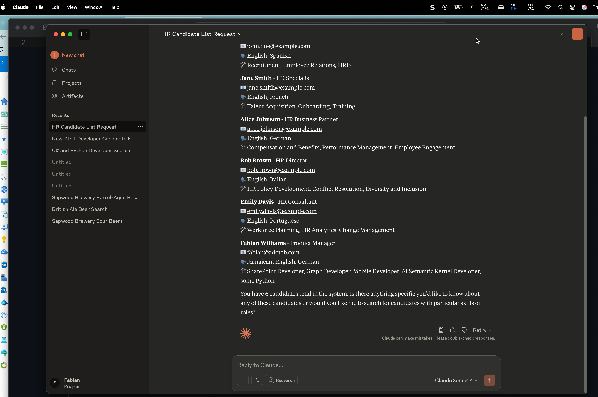

# HR MCP Server - Azure Container Apps Deployment

A Microsoft HR MCP (Model Context Protocol) server deployed to Azure Container Apps with HTTP streaming support and Azure Table Storage persistence. This server provides HR candidate management tools for AI assistants like Claude and Copilot Studio.

## 🚀 Live Server

**Production URL**: https://hr-mcp-server.jollyflower-9d7ab707.eastus2.azurecontainerapps.io

**Status**: ✅ **Working with persistent storage!** - Azure Table Storage integration completed



## 📋 Available Tools

The HR MCP server provides the following candidate management tools:

- `list_candidates` - List all candidates in the system
- `search_candidates` - Search candidates by criteria
- `add_candidate` - Add a new candidate
- `update_candidate` - Update existing candidate information
- `remove_candidate` - Remove a candidate from the system

## 🔧 Technology Stack

- **.NET 8.0** - ASP.NET Core web application
- **Model Context Protocol** - HTTP streaming transport
- **Azure Container Apps** - Serverless container hosting
- **Azure Table Storage** - Persistent candidate data storage
- **Azure Container Registry** - Private container image storage
- **GitHub Actions** - CI/CD pipeline

## 🏗️ Architecture

```
┌─────────────────┐    ┌──────────────────┐    ┌─────────────────┐
│   Claude/AI     │───▶│  HR MCP Server   │───▶│ Azure Table     │
│   Assistant     │    │ (Container Apps) │    │   Storage       │
└─────────────────┘    └──────────────────┘    └─────────────────┘
                                │
                       ┌──────────────────┐
                       │ Azure Container  │
                       │    Registry      │
                       └──────────────────┘
```

## 🚀 Quick Start

### For Claude Desktop

Add to your `claude_desktop_config.json`:

```json
{
  "mcpServers": {
    "hr-server": {
      "command": "npx",
      "args": [
        "-y",
        "mcp-remote",
        "https://hr-mcp-server.jollyflower-9d7ab707.eastus2.azurecontainerapps.io"
      ]
    }
  }
}
```

### For MCP Inspector

Test the server directly:

```bash
npx @modelcontextprotocol/inspector https://hr-mcp-server.jollyflower-9d7ab707.eastus2.azurecontainerapps.io
```

### For Copilot Studio

Use the production URL as your custom connector endpoint for MCP integration.

## 📦 Local Development

```bash
# Clone the repository
git clone https://github.com/fabianwilliams/hr-mcp-server.git
cd hr-mcp-server

# Build and run locally
dotnet build
dotnet run

# The server will be available at http://localhost:5000
```

**Note**: For local development, you'll need to configure the `TABLE_STORAGE_CONN_STRING` environment variable with your Azure Storage connection string.

## ☁️ Azure Deployment Journey

### Key Features Implemented

✅ **Azure Table Storage Persistence** - Candidate data survives container restarts  
✅ **Concurrent Connection Support** - Multiple clients can connect simultaneously  
✅ **Automatic Data Seeding** - Initial candidate data loaded from JSON file  
✅ **CI/CD Pipeline** - Automated deployments via GitHub Actions  
✅ **Production Ready** - Proper error handling and logging  

### Deployment Process

This project was deployed to Azure Container Apps with several challenges that were successfully resolved.

#### Initial Setup

```bash
# Create resource group
az group create --name mcpserversalpha --location eastus2

# Create Container Apps environment
az containerapp env create --name mcp-env --resource-group mcpserversalpha --location eastus2
```

## 🔧 Major Technical Solutions

### 1. Azure Table Storage Integration

**Problem**: In-memory storage caused data loss on container restarts and poor concurrent connection handling.

**Solution**: Implemented comprehensive Azure Table Storage integration:

- **`CandidateTableEntity`** - Maps candidate data to Table Storage format
- **`TableStorageCandidateService`** - Replaces in-memory storage with persistent storage
- **`DataSeedingService`** - Automatically populates initial data from JSON file
- **Async operations** - Proper handling of concurrent clients

**Table Schema**:
```
Table: "Candidates"
PartitionKey: "Candidate" (all candidates in same partition)
RowKey: candidate.Email (unique identifier)  
Properties: FirstName, LastName, Skills, SpokenLanguages, CurrentRole
```

### 2. .NET Framework Compatibility

**Problem**: Initial project targeted .NET 10.0, but Azure Container Registry only supports up to .NET 8.0.

**Solution**: Updated `hr-mcp-server.csproj` to target .NET 8.0:

```xml
<TargetFramework>net8.0</TargetFramework>
```

### 3. Container Registry Authentication

**Problem**: Container App couldn't pull custom image due to authentication issues.

**Solution**: 
1. Enabled system-assigned managed identity for Container App
2. Granted AcrPull role to the managed identity
3. Configured registry credentials using admin credentials

### 4. Port Configuration

**Problem**: ASP.NET Core app listening on port 8080, but Container App ingress configured for port 80.

**Solution**: Updated Container App ingress target port to match application port:

```bash
az containerapp ingress update --name hr-mcp-server --resource-group mcpserversalpha --target-port 8080
```

### 5. Claude Desktop MCP Configuration

**Problem**: Initial configuration used non-existent `@modelcontextprotocol/server-http` package.

**Solution**: Use `mcp-remote` package for HTTP-based MCP servers:

```json
{
  "command": "npx",
  "args": ["-y", "mcp-remote", "https://your-mcp-server-url"]
}
```

## 🔍 Environment Configuration

### Required Environment Variables

- `TABLE_STORAGE_CONN_STRING` - Azure Storage connection string for candidate persistence
- Optional: `ConnectionStrings__TableStorage` - Alternative configuration via connection strings

### Application Settings

The server automatically creates the "Candidates" table in Azure Table Storage and seeds initial data from `Data/candidates.json` if the table is empty.

## 🔍 Debugging Tips

### Check Active Revisions
```bash
az containerapp revision list --name hr-mcp-server --resource-group mcpserversalpha \
  --query "[].{name:name,active:properties.active,image:properties.template.containers[0].image}" -o table
```

### View Container Logs
```bash
az containerapp logs show --name hr-mcp-server --resource-group mcpserversalpha --follow false --tail 10
```

### Test MCP Endpoint
```bash
curl -X POST https://hr-mcp-server.jollyflower-9d7ab707.eastus2.azurecontainerapps.io/ \
  -H "Content-Type: application/json" \
  -d '{"jsonrpc":"2.0","id":1,"method":"initialize","params":{"protocolVersion":"2024-11-05","capabilities":{},"clientInfo":{"name":"test","version":"1.0"}}}'
```

Expected response:
```json
{
  "result": {
    "protocolVersion": "2024-11-05",
    "capabilities": {
      "logging": {},
      "tools": {"listChanged": true}
    },
    "serverInfo": {
      "name": "hr-mcp-server",
      "version": "1.0.0.0"
    }
  },
  "id": 1,
  "jsonrpc": "2.0"
}
```

## 📊 Performance & Scaling

- **Auto-scaling**: 0-10 replicas based on demand
- **Cold start**: ~2-3 seconds for first request
- **Response time**: <100ms for MCP tool calls
- **Concurrent sessions**: Supports multiple MCP clients with Azure Table Storage
- **Data persistence**: Survives container restarts and scaling events

## 🛡️ Security

- **HTTPS**: TLS 1.3 encryption for all communications
- **Managed Identity**: Secure access to Azure Container Registry
- **Connection strings**: Stored securely in Container App environment variables
- **No exposed secrets**: All credentials managed by Azure

## 📈 Monitoring

- **Application Insights**: Integrated telemetry and logging
- **Container Apps metrics**: CPU, memory, and request metrics
- **MCP session tracking**: Session IDs logged for debugging
- **Table Storage metrics**: Operation latency and success rates

## 🤝 Contributing

1. Fork the repository
2. Create a feature branch
3. Make your changes
4. Test locally and with MCP Inspector
5. Submit a pull request

## 📄 License

This project is based on Microsoft's MCP server samples and follows the same licensing terms.

## 🆘 Support

For issues with:
- **Deployment**: Check the solutions section above
- **MCP Protocol**: Refer to [Model Context Protocol docs](https://modelcontextprotocol.io/)
- **Azure Container Apps**: Check Azure documentation
- **Table Storage**: Review Azure Storage documentation

---

**Deployment completed**: July 24, 2025  
**Last updated**: July 24, 2025  
**Deployed by**: Claude Code (claude.ai/code)  
**Status**: ✅ Production ready with persistent storage